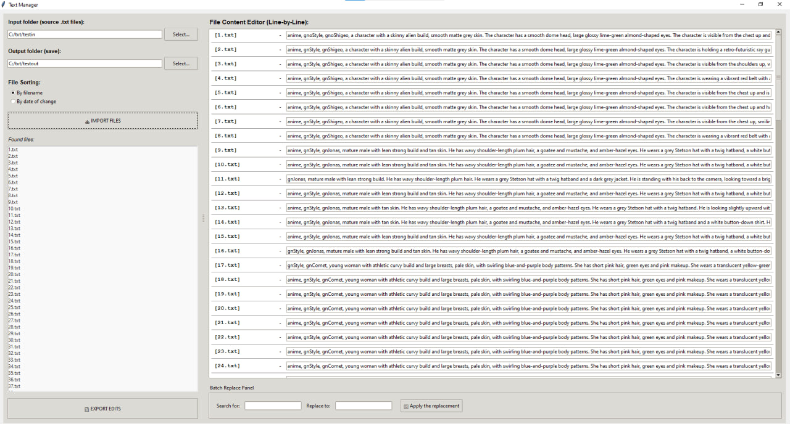

The program is designed primarily for fast processing of description files for machine learning datasets (especially for training LoRA / Stable Diffusion models). It allows you to quickly view, edit, and perform mass search-and-replace operations across hundreds of text files at once.

### Key Features:
- Load all `.txt` files from a folder with one click
- Line-by-line editing interface (each file on a separate line)
- Powerful **Batch Replace** tool (search and replace text/tags across all files)
- Two sorting options: by filename or by modification date
- Built-in protection against accidental overwriting of original files
- Supports UTF-8 and Cyrillic encodings
- Clean, lightweight, and easy-to-use GUI

The program does **not** claim any intellectual property. The code is completely free — you can modify, improve, distribute, or use it for any purpose.

### How to use:
1. Select input folder with your `.txt` files
2. Select output folder (must be different from input)
3. Edit texts manually or use mass replace
4. Click **Export Edits** to save all changes

**To compile into .exe:**
pyinstaller --noconfirm --onefile --windowed text_manager.py
## Screenshots

**License**: MIT — completely free to use, modify and distribute.
