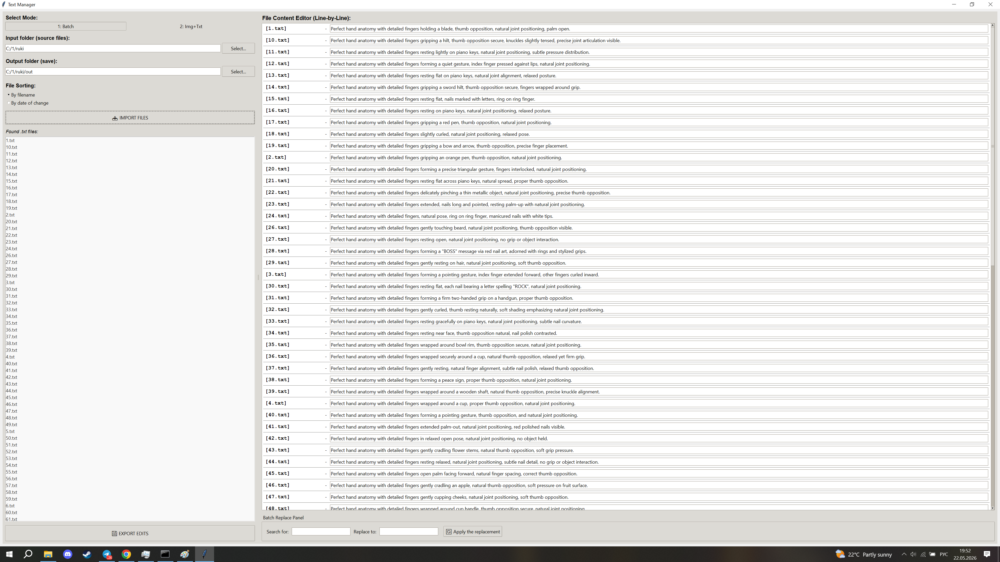
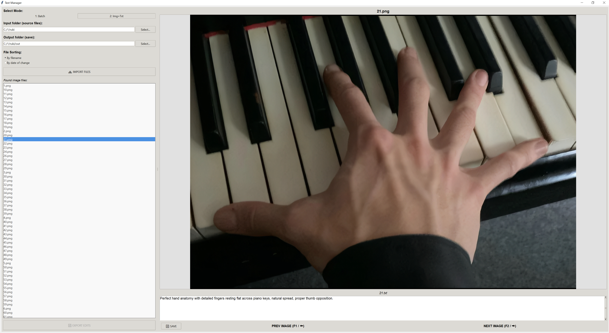

# TextManager

A powerful, lightweight Tkinter-based desktop application designed for efficient text and dataset management. Ideal for bulk editing, cleaning, and preparing text captions for machine learning and generative AI training workflows.

---
# Changelog

---

## v3 — Current Release

### New Features

- **Light / Dark Theme:** Single-button toggle between light and dark palettes. Dark mode uses true black (`#000000`) backgrounds optimized for OLED displays, with carefully tuned contrast for all UI layers — panels, canvas, entry fields, row highlights, and status bar. Theme state persists across mode switches without resetting any editor state.

- **Row-Level Save:** Each row in Batch Mode now has an individual `💾` save button, allowing single-file writes to the output directory without triggering a full export. Saved rows turn green immediately.

- **Row Color Indicators (Batch Mode):**
  - 🟡 Yellow — row has been edited but not yet saved
  - 🟢 Green — row has been saved to the output folder
  - 🔴 Red — save attempt failed (I/O error)
  - State updates in real time on every keystroke. Indicators are theme-aware and adapt to both light and dark palettes.

- **Text Filter / Search (Batch Mode):** Live filter bar in the Batch Mode header. Highlights all rows matching a query by filename or text content. Highlight color is user-configurable via a color picker. Filter state is preserved across theme switches.

- **Font Size Control:** Text size is adjustable via `+` / `−` buttons in the left panel or `Ctrl + Mouse Wheel` from anywhere in the window. Applies simultaneously to all Batch Entry fields and the Img+Txt prompt area. Range: 8–24 pt, step 1 pt.

- **Auto Output Folder:** If the Output folder field is left empty, the application automatically creates a folder named `<input_folder>-output` in the same parent directory. If that folder already exists, an error is shown and no files are written, preventing accidental overwrites.

- **Status Bar:** Persistent status line at the bottom of the window displaying current mode, total file count, number of modified files, and number of saved files. Updates on every edit and save operation.

- **Copy / Paste Context Menu:** Right-click context menu (Cut / Copy / Paste / Select All) available in all text input fields — both Batch Mode entry rows and the Img+Txt prompt area.

- **Drag & Drop Folder Input:** Input and Output folder fields accept folder paths via drag and drop (requires `tkinterdnd2`; silently skipped if not installed).

---

### Bug Fixes

- **`save_batch_fields_to_cache` never saved data** — `os.path.exists(entry_widget.winfo_id())` always returned `False` because `winfo_id()` returns an integer handle, not a file path. Replaced with `entry_widget.winfo_exists()`.

- **Arrow keys triggered image navigation while typing** — `←` / `→` now check whether a text widget currently holds focus before switching images. `F1` / `F2` continue to work unconditionally.

- **Arrow keys non-functional with non-Latin keyboard layouts (RU, JP, etc.)** — Replaced `<Left>` / `<Right>` keysym bindings with a `<KeyPress>` handler that checks `event.keycode` (Windows VK codes 37 / 39), which are layout-independent.

- **Clicking the image canvas did not release focus from text fields** — `img_canvas` now has `takefocus=True` and captures focus on `<Button-1>`, restoring arrow key navigation immediately after clicking the image.

- **File sorting failed on mixed or non-numeric filenames** — The previous `int()` cast raised `ValueError` for any non-numeric filename, aborting the entire sort. Replaced with a two-tier key: numeric stems sort first in integer order; non-numeric stems follow in case-insensitive alphabetical order.

- **Dark theme did not repaint all widgets** — `ttk.Style("TFrame")` does not affect `tk.Frame` instances. All plain `tk.Frame` containers (`top_bar`, `font_ctrl_frame`, `batch_header`, `search_bar`) are now registered in `self.plain_frames` at construction and explicitly repainted on every theme switch. Likewise for `tk.Button` instances registered in `self.plain_buttons`.

- **`ttk.Entry` fields kept light backgrounds in dark mode** — Applied a global `TEntry` style with `fieldbackground` and `foreground` overrides, covering all entry fields including folder paths, the filter bar, and the Batch Replace panel.

- **Text filter highlight reset on theme switch** — `apply_theme` now re-invokes `_on_filter_change()` after repainting rows, preserving active highlight state.

- **Status bar `Saved` counter did not update** — Replaced per-call disk reads with an in-memory `saved_set`. Files are added to the set on every successful write (individual row save, full export, or Img+Txt save). Counter reflects the set size instantly.

- **Row color check read files from disk on every keystroke** — `_update_row_color` previously opened and read output files on each call to determine saved state. Replaced with an O(1) lookup against `saved_set`.

---

## v2

See [Technical Enhancements (v2)](#technical-enhancements-v2) section above.

---

## v1

Initial release. See [Legacy Limitations (v1 Retrospective)](#legacy-limitations-v1-retrospective) for a summary of known gaps addressed in later versions.

 ## Technical Enhancements (v2)

The current version introduces architectural changes, interface unification, and modern display compatibility:

*   **HiDPI / 4K Monitor Support:** Native integration via OS-level DPI awareness (`ctypes` wrapper for Windows systems). Text, widgets, and canvas elements render crisply without system blurring or layout distortion.
*   **Unified Translation:** Complete overhaul of all dialogues, notifications, and error states into clean, context-accurate technical English.
*   **Optimized Memory Lifecycle:** Implements a strict two-tier data management system. Edits are handled in an isolated memory cache (`text_cache`) and matched against raw pristine disk snapshots (`disk_snapshots`) before any file write operations occur.
*   **Dynamic Data Contextualization:** Action states and warning modals adapt seamlessly to runtime choices, ensuring clear file tracking across modes.

---

## Dual-Mode Architecture

### 1. Batch Mode (Line-by-Line Editor)
Designed for mass modifications and global overviews of text-only files.

*   **Granular Interface:** Dynamically maps every `.txt` file in the directory to an isolated row widget with permanent filename tracking.
*   **Flexible Sorting Logic:** Instant indexing by strict alphanumeric filename patterns or reverse chronological order (by last modification date).
*   **Global Batch Replace Panel:** Allows execution of massive find-and-replace queries spanning across the entire memory cache simultaneously.
*   **Bulk Export Gate:** Features a dedicated export mechanism to deploy modified caches to target output paths safely without overlapping raw inputs.

### 2. Img+Txt Mode (Paired View)
Tailored specifically for dataset validation, pairing images directly with their corresponding text files or text descriptions.

*   **Asynchronous Scaling Canvas:** High-performance responsive image preview using PIL/Pillow with Lanczos resampling filters, adjusting on-the-fly to window scaling.
*   **Contextual Safety Modals:** Integrated protection warning loops that check current field modifications against disk snapshots when skipping files, preventing accidental data loss.
*   **Hotkeys & Navigation:** Full binding mapping support for quick switching (`F1` / `Left Arrow` for Previous, `F2` / `Right Arrow` for Next).

---

## Interface Previews

### Batch Mode View

### Img+Txt Mode View

---

## Legacy Limitations (v1 Retrospective)
Compared to the current version, the initial prototype (`v1`) had architectural gaps that limited production workflows:
*   **No HiDPI Awareness:** UI scaled poorly on high-resolution/4K screens, resulting in blurry fonts and layout clipping.
*   **Lack of Paired Validation:** Missing an interactive canvas view, making it impossible to evaluate text files directly alongside graphical inputs.
*   **No Multi-Format Fallbacks:** Lacked flexible codec mapping during directory parses, which frequently led to crash loops or data dropouts when reading non-UTF-8 character sets.
*   **No Contextual State Guardrails:** Lacked verification loops to catch volatile memory changes before interface navigation or directory updates.
